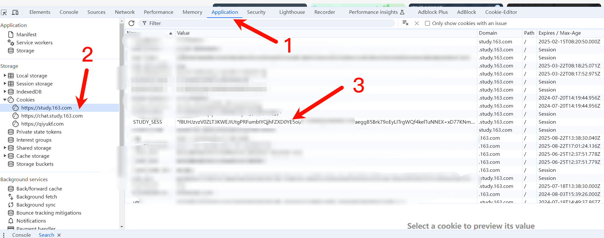
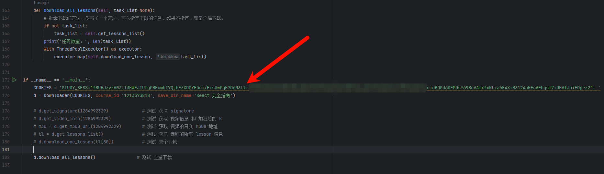
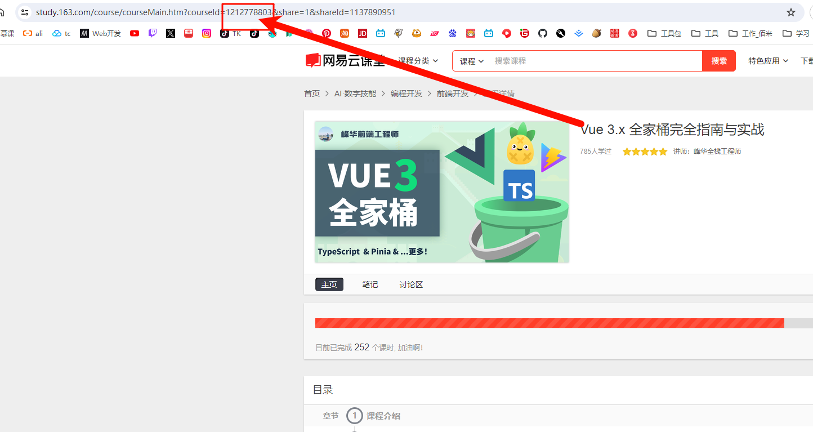
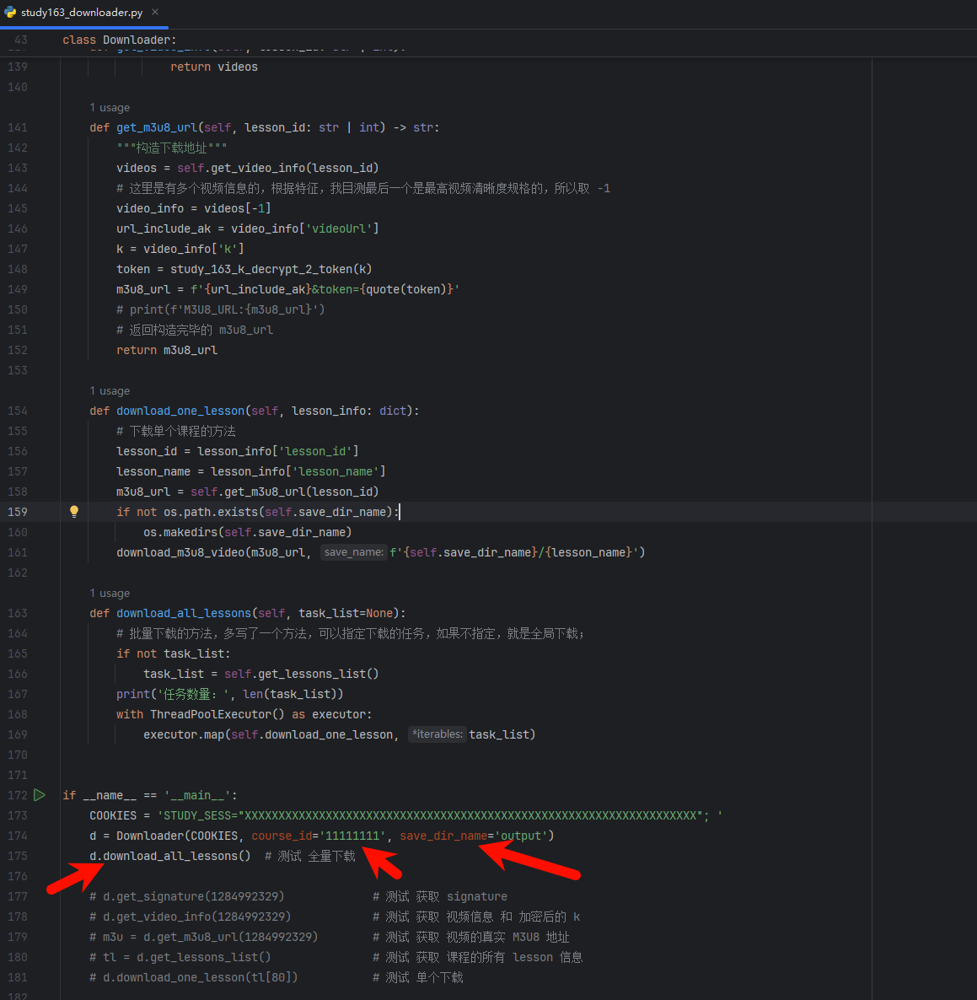

# 1.工具用途
下载【网易云课堂】已购的视频课程

# 2. 准备工作
## 2.1 安装环境
```pip install -r requirements.txt```
## 2.2 获取 COOKIES 中的 STUDY_SESS 参数



# 3. 配置下载对象 和 运行
## 3.1 获取课程id

## 3.2 设置课程id 和 保存文件夹名称


# 4. 其它
如果能帮到你，请 3 只小猫吃个罐头吧


